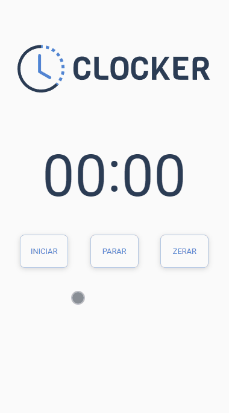
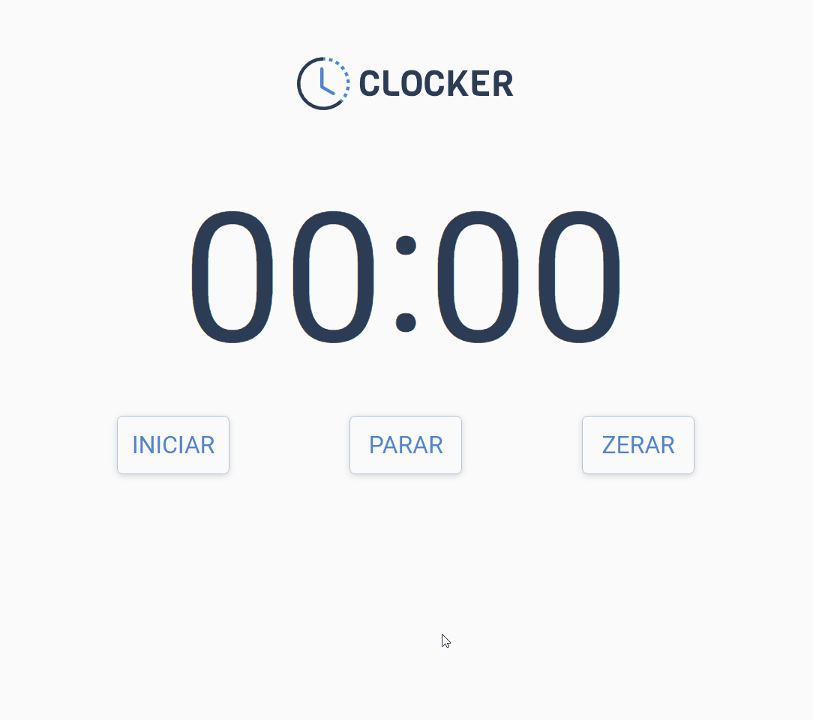

<h1>Clocker</h1>

<p align="center">
<a href="#code">Veja o código</a> • 
<a href="#show">Veja o projeto</a>
</p>

<br>
<h2>Sobre</h2>
<p>Um site para cronometrar tempo usando javascript, acesse em: <a href="https://clockerjs.netlify.app/">https://clockerjs.netlify.app/</a></p>

<br>
<h2 id="code">Código javascript do projeto</h2>
<br>
<h3>support.js</h3>
<p>Contém a funções utéis e fora de context</p>

<br>

```
export function useState(address) {
    let webElement = document.querySelector(address)
    return [
        webElement.innerHTML, 
        function(newValue) {
            webElement.innerHTML = newValue
            return newValue
        }
    ]
}
```

<br>

<h3>timer.js</h3>
<p>Contém a classe principal do projeto</p>

<br>

```
import { useState } from './support.js'


class Timer {

    constructor (minutesAddress, secondsAddress){
        let [minutes, setMinutes] = useState(minutesAddress)
        let [seconds, setSeconds] = useState(secondsAddress)
        this.minutes = minutes
        this.setMinutes = setMinutes
        this.seconds = seconds
        this.setSeconds = setSeconds
    }

    start = () => {
        this.interval = setInterval(this.updateTimer, 1000)
    }

    stop = () => {
        if (this.interval){
            clearInterval(this.interval)
        }
    }

    end = () => {
        this.stop()
        this.seconds = this.setSeconds('00')
        this.minutes = this.setMinutes('00')
    }

    updateTimer = () => {
        let currentSeconds = Number(this.seconds)
        let currentMinutes = Number(this.minutes)

        if(currentSeconds < 59) {
            this.updateSeconds(currentSeconds)
        } else if(currentSeconds === 59) {
            this.updateMinutes(currentMinutes)
        }
    }

    updateSeconds = (currentSeconds) => {
        this.seconds = this.setSeconds(this.adaptTimeNumber(currentSeconds + 1))
    }

    updateMinutes = (currentMinutes) => {
        this.minutes = this.setMinutes(this.adaptTimeNumber(currentMinutes + 1))
        this.seconds = this.setSeconds('00')
    }

    adaptTimeNumber = (timeNumber) => timeNumber < 10 ? `0${timeNumber}` : timeNumber
}


export default Timer
```

<br>

<h3>main.js</h3>
<p>Contém a instância da classe e principais eventos</p>

<br>

```
import Timer from './timer.js'


const timer = new Timer('.minutes', '.seconds')

document.querySelector('button[type="start"]').addEventListener('click', timer.start)
document.querySelector('button[type="stop"]').addEventListener('click', timer.stop)
document.querySelector('button[type="end"]').addEventListener('click', timer.end)
```

<br>

<h2 id="show">Veja</h2>

<h3>No celular</h3>

<kbd></kbd>

<h3>No computador</h3>

<kbd></kbd>